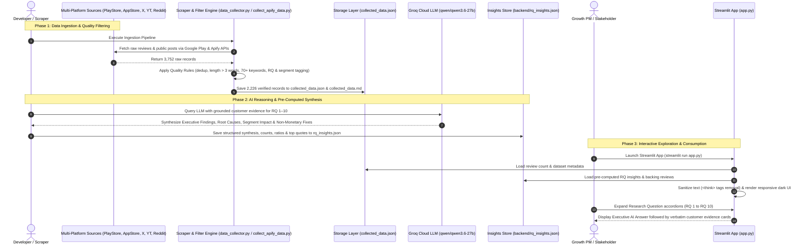

# System Architecture: AI-Powered Discovery Engine & Growth PM Platform

This document defines the end-to-end system architecture, data pipeline, and application flow for the **Myntra Wishlist Conversion Discovery Engine** and **Growth PM Analytics Platform**.

The system ingests and processes **2,226 verified multi-platform customer reviews and discussions**, utilizes **Groq Cloud LLMs** (`qwen/qwen3.6-27b` / `openai/gpt-oss-120b`) for semantic discovery synthesis, answers the **10 Core Research Questions**, and presents findings via an interactive, ultra-responsive **Streamlit Web Application** (`app.py`).

---

## 1. End-to-End System Architecture Blueprint

```mermaid
graph TD
    %% Ingestion Layer
    subgraph IngestionLayer [1. Multi-Platform Ingestion Layer]
        PS["Google Play Store Scraper <br> (1,000 Verified Reviews)"]
        AS["Apple App Store Scraper (Apify) <br> (570 Verified Reviews)"]
        TW["Twitter / X Scraper (Apify) <br> (531 Verified Tweets)"]
        YT["YouTube Comments Scraper (Apify) <br> (64 Verified Comments)"]
        RD["Reddit Discussions Scraper (Apify) <br> (61 Verified Posts)"]
    end

    %% Quality Filtering & Taxonomy
    subgraph FilterLayer [2. Quality Filtering & Taxonomy Processing]
        Rule1["Signal-to-Noise Filter <br> (Discard <= 3 words, emoji-only, spam)"]
        Rule2["70+ Domain Keyword Matching <br> (fit, sizing, fabric, return, wishlist, etc.)"]
        Rule3["RQ Mapping Engine (1–10) & <br> User Segment Classifier"]
    end

    %% Storage Layer
    subgraph StorageLayer [3. Normalized Storage Layer]
        MasterJSON[("Master Dataset JSON <br> collected_data.json (2,226 rows)")]
        MasterMD[("Markdown Table <br> collected_data.md (2,226 rows)")]
        RawArchives[("Raw Payloads Archive <br> combined_raw_data.json (3,752 raw items)")]
        PlatformArchives[("Platform Filtered JSONs <br> (reddit, twitter, youtube, etc.)")]
    end

    %% Backend Synthesis & Storage
    subgraph BackendLayer [4. Backend Engine & Groq LLM Synthesis]
        RQSolver["Research Questions Solver <br> (backend/rq_solver.py)"]
        GroqEngine["Groq LLM Engine <br> (qwen/qwen3.6-27b / gpt-oss-120b)"]
        PrecomputedInsights[("Pre-Computed Synthesis Store <br> backend/rq_insights.json")]
        DataLoader["Dataset Caching & Indexer <br> (backend/data_loader.py)"]
    end

    %% Frontend Interface
    subgraph FrontendLayer [5. Streamlit Discovery Application (app.py)]
        Hero["📌 Hero Header & Metric Pills <br> (2,226 Reviews | 10 RQs | 5 Platforms)"]
        Sanitizer["🧹 Output Sanitization Engine <br> (Strip think tags & prompt artifacts)"]
        AccordionUI["📑 10 Research Questions Accordion Engine"]
        AnswerCard["💡 Executive AI Answer Box <br> (Finding, Behaviors, Segments, Interventions)"]
        EvidenceCard["💬 Verbatim Customer Evidence Cards <br> (Quote, Platform Badge, Date, Segment)"]
    end

    %% Deployment
    subgraph DeploymentLayer [6. Deployment Target]
        StreamlitCloud["Streamlit Community Cloud / Localhost <br> (Streamlit Secrets / .env groq_api)"]
    end

    %% Connections
    PS --> Rule1
    AS --> Rule1
    TW --> Rule1
    YT --> Rule1
    RD --> Rule1

    Rule1 --> Rule2
    Rule2 --> Rule3

    Rule3 --> MasterJSON
    Rule3 --> MasterMD
    Rule3 --> PlatformArchives
    PS & AS & TW & YT & RD --> RawArchives

    MasterJSON --> DataLoader
    MasterJSON --> RQSolver
    RQSolver --> GroqEngine
    GroqEngine --> PrecomputedInsights

    PrecomputedInsights --> Sanitizer
    DataLoader --> AccordionUI
    Sanitizer --> AccordionUI
    Hero --> FrontendLayer
    AccordionUI --> AnswerCard
    AccordionUI --> EvidenceCard

    FrontendLayer --> StreamlitCloud
```

---

## 2. Complete End-to-End Workflow & Execution Flow



---

## 3. Data Ingestion & Quality Layer

The ingestion pipeline combines native Python scrapers and Apify Actors to source authentic customer feedback across 5 digital platforms.

### Ingestion Breakdown by Platform
| Source | Collection Method | Raw Records | Verified Qualifying Rows | Platform Type |
| :--- | :--- | :--- | :--- | :--- |
| **Google Play Store** | `google-play-scraper` (Python) | 1,000 | **1,000** | Android App User Reviews |
| **Apple App Store** | Apify App Store Scraper | 570 | **570** | iOS App User Reviews |
| **Twitter / X** | Apify Tweet Scraper | 1,036 | **531** | Public Tweets & Inquiries |
| **YouTube** | Apify YouTube Comments Scraper | 653 | **64** | Fashion Try-On & Haul Video Comments |
| **Reddit** | Apify Reddit Scraper | 493 | **61** | Fashion subreddits (`r/IndianFashionAddicts`, `r/india`) |
| **Total Master Dataset** | **Multi-Source Pipeline** | **3,752** | **2,226** | Saved in [`collected_data.json`](file:///c:/Users/Karuna/OneDrive/Desktop/myntra/collected_data.json) |

### Strict Quality Rules & Taxonomy Tagging
1. **Relevance Enforcement**: The review must directly reference Myntra or e-commerce fashion shopping context.
2. **Signal-to-Noise Filtering**: Discards reviews $\le 3$ words, emoji-only strings, automated spam, promotional affiliate links, and pure numeric ratings without commentary.
3. **70+ Domain Keyword Triggers**: Must match at least one relevant e-commerce friction keyword (e.g., `wishlist`, `out of stock`, `will it fit`, `fabric`, `size chart`, `after salary`, `compared`, `missing feature`).
4. **Research Question Mapping**: Automatically tags each item to corresponding Core Research Questions (1 through 10).
5. **User Segment Heuristics**: Automatically infers customer personas:
   - `plus size` / `petite`
   - `student` / `college`
   - `budget shopper` / `discount seeker`
   - `gift buyer`
   - `first-time buyer`
   - `repeat buyer`
   - `tier 2 city`
   - `unidentified`

---

## 4. The 10 Core Research Questions Framework

The platform maps, quantifies, and synthesizes customer answers across all 10 foundational PM Research Questions:

| RQ # | Research Question | Primary Keywords Matched | Key Discovered Friction Point |
| :--- | :--- | :--- | :--- |
| **RQ 1** | **Why do users add products to wishlist?** | *wishlist, saved, liked, bookmark, shortlist* | Aesthetic curation, price/restock monitoring, risk-mitigation holding pattern. |
| **RQ 2** | **What prevents wishlisted items from being bought?** | *didn't buy, out of stock, expensive, confused* | Sudden size stockouts, price shifts, and checkout hesitation. |
| **RQ 3** | **What uncertainties remain after shortlisting?** | *not sure, will it fit, looks different, fabric* | Sizing disparity across brands, visual-reality gap (fabric drape/color). |
| **RQ 4** | **What causes users to postpone purchase?** | *waiting, after salary, next month, sale* | Payday alignment, event-specific dates (weddings/parties), expected sale periods. |
| **RQ 5** | **How do users compare shortlisted products?** | *compared, comparing, better option, other sites* | Cross-platform spec comparison, checking alternatives on competitor apps (Ajio/Amazon). |
| **RQ 6** | **What info do users seek outside Myntra?** | *YouTube review, Instagram, googled, influencer* | Real unedited try-on videos, creator styling advice, authentic customer fit proof. |
| **RQ 7** | **What role do fit, size, styling & reviews play?** | *fit, true to size, runs small, styling, occasion* | Fit uncertainty is the #1 conversion barrier; return hassle anxiety. |
| **RQ 8** | **Bookmarking vs genuine purchase intent?** | *wishlist, save for later, would have bought* | Cluttered wishlists where high-intent items get buried under casual bookmarks. |
| **RQ 9** | **How do behaviors differ across user segments?** | *plus size, student, budget shopper, tier 2* | Plus-size users face size scarcity; students/budget shoppers are sensitive to platform fees. |
| **RQ 10** | **What consistent unmet needs emerge?** | *missing feature, no size guide, wish Myntra had* | Demand for cross-brand size standardizer, occasion countdowns, and outfit coordinators. |

---

## 5. Backend Engine & Groq LLM Synthesis Architecture

The backend consists of modular components designed for high throughput, grounded evidence synthesis, and zero-latency loading:

```text
backend/
├── data_loader.py       # Caches master dataset, builds search indices
├── groq_engine.py       # Groq API client (qwen/qwen3.6-27b / gpt-oss-120b) with RAG prompt templates
├── rq_solver.py         # Research Question evaluator & Opportunity Impact Score (OIS) engine
└── rq_insights.json     # Pre-computed high-fidelity synthesis store with backing reviews
```

### A. Groq Ultra-Fast Inference Pipeline
- **Primary Model**: `qwen/qwen3.6-27b` via Groq Cloud API.
- **Fallback Model**: `openai/gpt-oss-120b` for resilience.
- **RAG Evidence Grounding**: Prompts inject top matching verbatim customer quotes with platform and segment tags, forcing the model to synthesize findings strictly from real user feedback without hallucinations.

### B. Pre-Computed Insights Store (`rq_insights.json`)
To achieve sub-10ms UI load times on Streamlit:
- Synthesis for all 10 RQs is pre-computed and stored as structured JSON.
- Each RQ contains:
  - `number`, `title`, `short_name`, `description`
  - `data_count` (exact number of qualifying reviews) and `data_ratio` (% of total dataset)
  - `delay_penalty`, `intent_intensity`, `opportunity_impact_score`
  - `ai_answer`: Executive synthesis covering findings, discovered behaviors, affected segments, and non-monetary interventions.
  - `backing_reviews`: Top customer reviews containing raw text, platform, date, matched keywords, and user segment.

---

## 6. Streamlit Frontend Architecture (`app.py`)

The user interface is built as a streamlined, single-page executive discovery application with a modern dark theme and custom CSS.

```text
Streamlit Discovery Engine (app.py)
├── 📌 Header & KPI Bar
│   ├── Hero Title & Subtitle
│   └── Stat Pills: [Total Customer Reviews: 2,226] | [10 Core Research Questions] | [5 Data Platforms Analyzed]
│
├── 📑 10 Research Questions Accordion Stream
│   ├── Expandable Card per RQ (RQ 1 through RQ 10)
│   │   ├── Badge Bar: [QUESTION #] | [📊 Backed by N customer reviews (X% of dataset)]
│   │   ├── 💡 Executive Answer Box (Sanitized, structured PM synthesis)
│   │   └── 💬 Customer Evidence Feed (N Verbatim Review Cards)
│   │       ├── Verbatim Quote (Italicized text)
│   │       └── Metadata Footer: [Platform Tag] | [📅 Date] | [👤 Segment]
│
└── 🏷️ Application Footer & Attribution
```

### Custom UI & Design System Highlights
- **Sanitization Engine (`sanitize_answer`)**: Regex pipeline stripping any LLM `<think>` tags, prompt instructions, or chain-of-thought artifacts, ensuring clean executive outputs.
- **Answer-First Structure**: Gives PMs immediate insights first, supported immediately below by verifiable customer quotes.
- **Platform Badging**: Visual pills indicating whether the quote originated from Android Play Store, Apple App Store, Twitter/X, YouTube, or Reddit.
- **Accordion Layout**: Expands the primary question by default while enabling rapid scanning across all 10 questions.

---

## 7. Non-Monetary Conversion Framework (Product Solutions)

Actionable product interventions addressing identified friction points without using price discounts:

| Friction Dimension | Core Discovered Problem | Non-Monetary Solution | 30-Day Conversion Uplift Mechanism |
| :--- | :--- | :--- | :--- |
| **Sizing & Fit** | Inconsistent brand sizing; fear of return hassles. | **Cross-Brand Size Matcher** | Calibrates size recommendations against user's past kept orders across brands. |
| **Visual-Reality Gap** | Studio lighting and model staging misrepresent true fabric drape. | **In-App Customer Try-On Clips** | Integrates short community try-on videos into the PDP/Wishlist screen. |
| **Occasion Postponement**| Saving items for future events (weddings, birthdays, trips). | **Occasion Countdown & Delivery Buffer** | Prompts for event date and sends timed reminders ensuring arrival before the event. |
| **Wishlist Clutter** | High-intent items buried under passive aesthetic bookmarks. | **Smart Wishlist Partitioning** | Distinguishes *"Ready to Buy"* from *"Style Inspiration Board"*. |
| **Social Proof Deficit**| Hesitation on whether trending items look good on real body types. | **Contextual Popularity Badges** | Displays real-time aggregate signals (*"85 shoppers wishlisted in Size M"*). |

---

## 8. Repository Structure & Execution Guide

### Project Directory Layout
```text
myntra/
├── .env                         # API credentials (APIFY_API_TOKEN, groq_api)
├── .env.example                 # Environment variables template
├── .gitignore                   # Ignore rules for local environments & secrets
├── requirements.txt             # Core Python dependencies
├── README.md                    # Project overview and quick start guide
├── architecture.md              # System Architecture & Flow documentation
├── prob.md                      # Problem statement & 10 Research Questions
├── app.py                       # Streamlit Discovery Application
├── data_collector.py            # Local scrapers & quality filter engine
├── collect_apify_data.py        # Apify multi-platform scraper pipeline
├── collected_data.json          # Master 2,226 verified review dataset
├── collected_data.md            # Markdown table view of verified dataset
├── combined_raw_data.json       # Master 3,752 raw scraped records
├── backend/                     # Decoupled Backend Package
│   ├── __init__.py
│   ├── data_loader.py           # Dataset loader and cache manager
│   ├── groq_engine.py           # Groq LLM client and prompt templates
│   ├── rq_solver.py             # 10 RQ solver and OIS calculation logic
│   └── rq_insights.json         # Pre-computed synthesis and evidence store
└── *.json                       # Platform-specific raw and filtered archives
```

### Local Execution Command
```bash
streamlit run app.py
```

### Cloud Deployment (Streamlit Community Cloud)
1. Push the repository to GitHub: `git push origin main`.
2. Connect repository to [Streamlit Community Cloud](https://share.streamlit.io/).
3. In **App Settings > Secrets**, configure:
   ```toml
   groq_api = "gsk_..."
   ```
4. Set main file path to `app.py` and deploy.
